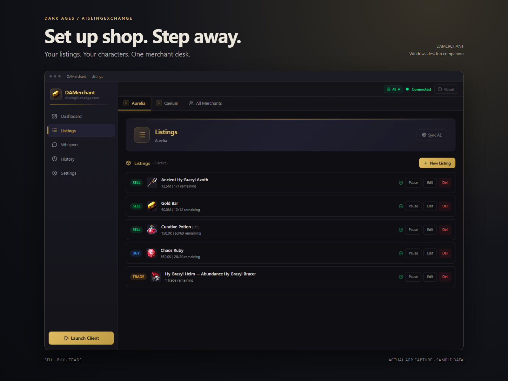
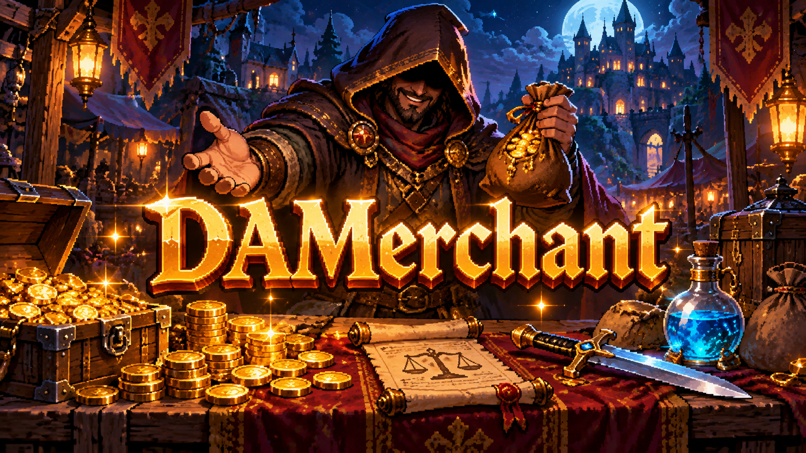
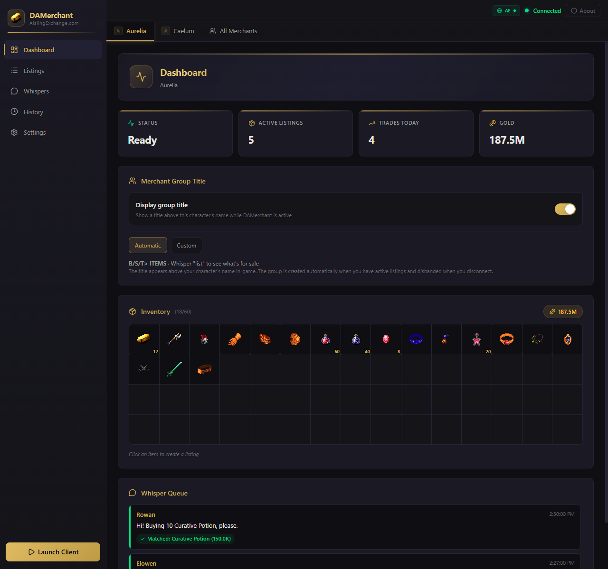
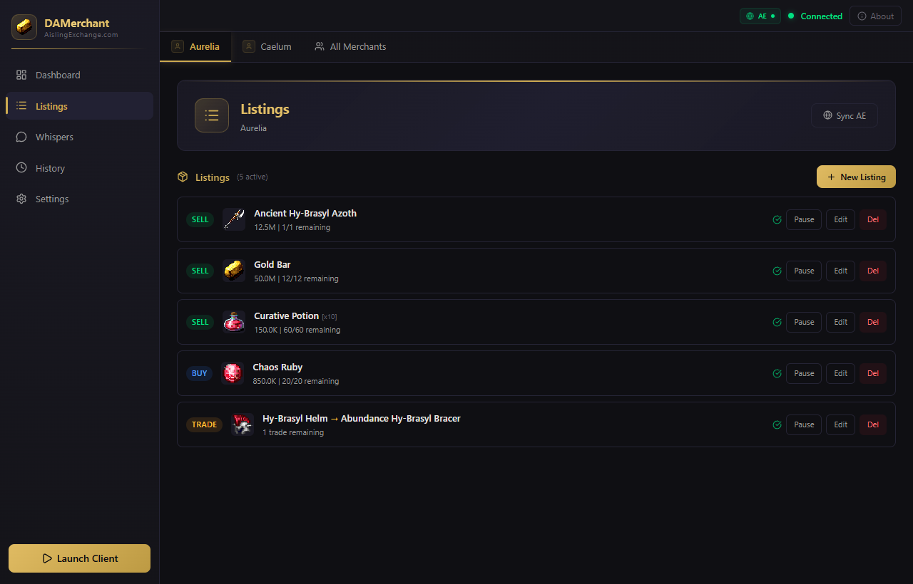
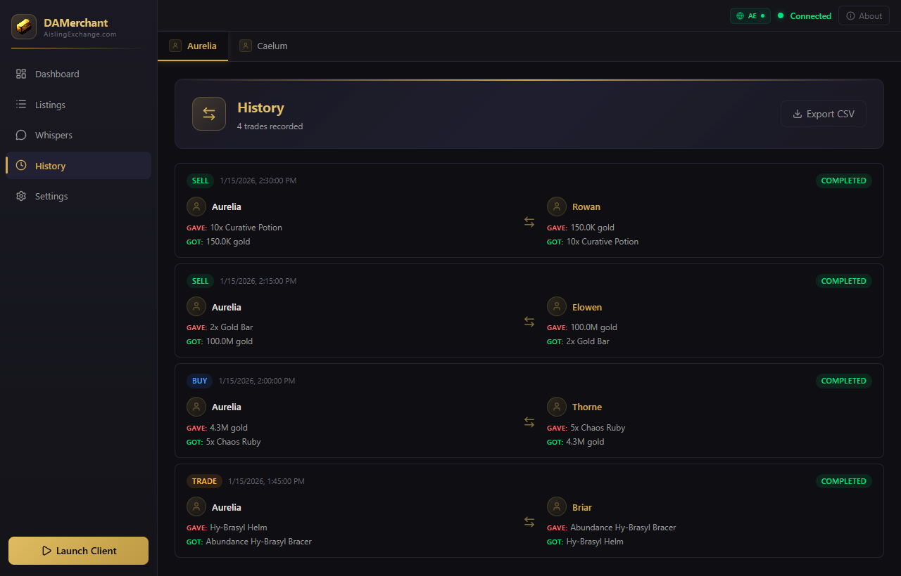

# DAMerchant

<p align="center">
  
</p>

<p align="center"><strong>Your shop stays open. Your hands stay free.</strong><br />
Automated Dark Ages trading, connected to AislingExchange.</p>

<p align="center">
  <a href="https://github.com/BuildWithRaymond/DAMerchant/releases/latest"></a>
  
  <a href="LICENSE"></a>
</p>

<p align="center">
  <a href="https://github.com/BuildWithRaymond/DAMerchant/releases/latest">Download for Windows</a> &middot;
  <a href="#getting-started">Get started</a> &middot;
  <a href="CONTRIBUTING.md">Contribute</a> &middot;
  <a href="https://github.com/BuildWithRaymond/DAMerchant/issues">Report an issue</a>
</p>



> **Merchant Mode is now DAMerchant.** Same great trading system, new name. Recent updates make SELL exchanges safer, cancel unrelated offers promptly, keep completed sales in History and listing counts, add automatic group titles, improve character portraits, and support the current Dark Ages 7.41 client. Existing settings and trade data stay in place.

<p align="center">
  
</p>

DAMerchant is a Windows desktop app for running a shop in **Dark Ages**. Create sell, buy or trade listings, respond to buyer whispers, and complete exchanges automatically. Manage multiple characters from one window and connect your listings to [AislingExchange](https://aislingexchange.com).

## Built for the merchant workflow

- **Sell, buy and barter.** Set prices, quantities, stack sizes and wanted items. Listings pause when inventory or funds are unavailable.
- **Turn whispers into trades.** Match incoming messages to listings, send configurable replies, and fill exchange windows.
- **Confirm the visible sale.** For SELL listings, place the item after the buyer offers the exact price, then accept only after the server shows the item and the buyer accepts that offer. Changed offers cancel the exchange.
- **Keep characters organized.** Separate inventory, listings and engine state for each connected character, with automatic reconnect support.
- **Reach the wider market.** Browse online merchants and sync selected listings with your AislingExchange account.
- **See what happened.** Review matched whispers and both sides of completed exchanges, then export transaction history to CSV.
- **Show what you trade.** The in-game group title follows active sell, buy and trade listings automatically. Switch to a custom title and description on the Dashboard when you prefer your own message.

## Screenshots

Actual app screens with fictional sample data. [Capture them locally](docs/screenshots.md).

<details>
<summary><strong>Dashboard — inventory, gold and matched whispers</strong></summary>



</details>

| Listings | Trade history |
| --- | --- |
| [](docs/images/listings-v1.1.9.png) | [](docs/images/history-v1.1.9.png) |

## Getting started

1. Download the Windows installer from [GitHub Releases](https://github.com/BuildWithRaymond/DAMerchant/releases/latest) and install DAMerchant.
2. Open **Settings** and select your `Darkages.exe` if it is not in the default installation folder.
3. Click **Launch Client**, then sign in to your game character. A character tab appears once connected.
4. Open **Listings** to add a sell, buy or trade listing, or click an inventory item on the Dashboard.
5. Keep the client connected. Use the Dashboard, Whispers and History screens to follow trading activity.

The built-in launcher supports the verified Dark Ages 7.41 client layouts, including the newer layout that previously produced a version mismatch at `0x57a7d0`. Select the installed `Darkages.exe` in Settings if needed. The newer layout shows the normal intro sequence.

To sync marketplace listings, sign in to AislingExchange in **Settings**. Use each listing's sync option to control what is published. The **All Merchants** tab shows the live merchant network.

### Existing bot or proxy setup

DAMerchant listens on `127.0.0.1:2615`. Point your existing client/proxy chain at that endpoint when using another launcher. The separate port avoids the commonly used `2610`–`2612` range.

### Local data

Settings, listings, transaction history and AE authentication remain in `merchantmode.db` under the existing `merchantmode` user data directory, including after the DAMerchant rename. They are separate from the source checkout. Back up the app's data before moving installations; keep that database and packet logs private.

## Development

**Requirements:** Windows, Node.js 22+, and npm. Live trading also needs a Dark Ages installation. Compilation and screenshot captures work without a game account.

```sh
git clone https://github.com/BuildWithRaymond/DAMerchant.git merchantmode
cd merchantmode
npm ci
npm run electron:dev
```

| Command | Purpose |
| --- | --- |
| `npm run dev` | Start the Vite renderer server; no Electron bridge or game connection |
| `npm run electron:dev` | Build and launch the desktop app |
| `npm run typecheck` | Check renderer and Electron TypeScript configurations |
| `npm test` | Run simulated exchange packet tests without a game account |
| `npm run build` | Check types and build both renderer and Electron code |
| `npm run dist:local` | Build a Windows installer without publishing |
| `npm run screenshots` | Capture the renderer with offline sample data |

Native dependencies are rebuilt for Electron during `npm ci`. See [Contributing](CONTRIBUTING.md) for setup troubleshooting and validation expectations.

## How it works

```text
Dark Ages client  <-->  Local proxy :2615  <-->  Game server
                              |
                     Per-character engines
                              |
               Electron + SQLite + React UI
                              |
                    AislingExchange API
```

The launcher routes the game client through a local TCP proxy. Per-character engines track inventory, match whispers, coordinate exchanges and record transactions. Electron connects that core to the React interface through a preload bridge.

## Project guide

- [Architecture and source map](docs/architecture.md)
- [Contributing and validation](CONTRIBUTING.md)
- [Building and publishing releases](docs/releases.md)
- [Screenshot workflow](docs/screenshots.md)
- [Changelog](CHANGELOG.md)

Built with Electron, React, TypeScript, Vite, Tailwind CSS and SQLite.

## License and credits

Project code is available under the [ISC license](LICENSE). Dark Ages artwork and third-party dependencies retain their respective owners' rights; see [third-party notices](docs/third-party-notices.md). DAMerchant is a community project, not an official Dark Ages client.
