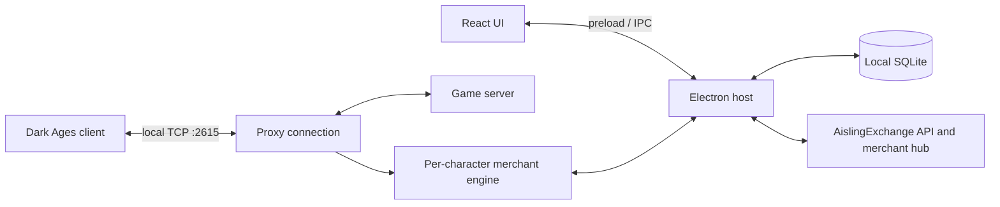

# Architecture

DAMerchant has three layers: a React renderer, an Electron host, and a TypeScript trading core.

## Where to start

| Path | Responsibility |
| --- | --- |
| `electron/main.ts` | App lifecycle, IPC handlers, character contexts, packet routing, updates |
| `electron/preload.ts` | Renderer-facing bridge exposed as `window.merchantMode` |
| `src/vite-env.d.ts` | TypeScript contract for the bridge and merchant data |
| `src/pages/`, `src/components/` | Screens and reusable UI |
| `core/proxy/` | TCP forwarding, connection phases, encryption state and redirects |
| `core/engine/` | Whisper matching, exchanges, inventory, entities and location |
| `core/network/` | Binary serialization, encryption, opcodes and merchant hub client |
| `core/db/database.ts` | Schema, migrations, settings, listings and transactions |
| `core/ae/` | Authentication, item cache and marketplace listing sync |
| `core/launcher/`, `core/reconnect/` | Windows client launch and reconnect handling |
| `public/items/` | Item sprites selected at runtime by numeric game sprite ID |
| `build/` | App icons used by the Windows packager |

## Trading flow

The proxy listens on `127.0.0.1:2615`. The launcher patches the game client's connection settings in memory to route it through that proxy. Each connected character has its own engine, inventory tracker, location tracker and connection reference.

Incoming whispers are matched against the character's listings. The engine coordinates replies and exchanges, checks received items or gold, and records the result. Inventory and gold changes can pause or resume listings. The Electron host forwards state changes to the renderer through IPC.

The active packet implementation lives in the proxy, engine and Electron host. Packet changes must preserve ordering, encryption counters, stack quantity handling and acceptance state. Protocol constants remain in `core/network/packets/`.

## Storage and external services

`merchantmode.db` lives under Electron's `app.getPath('userData')`, outside the repository. It contains listings, transactions, settings, the item cache, sync bookkeeping and persisted AE authentication. Reconnect credentials are held by the running application. Treat local databases and packet logs as private.

The merchant hub shares connected characters, map locations and active listing details. Account-backed marketplace sync imports and publishes listings; the item cache also has a SQLite fallback. API or game access is not needed by the screenshot tool, which uses a separate preload and blocks network requests.

For exact IPC methods and schema details, use the source files above. They are the authoritative references.
